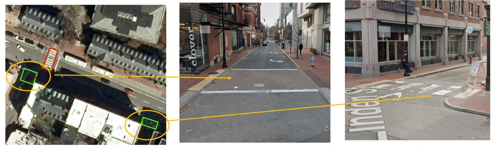
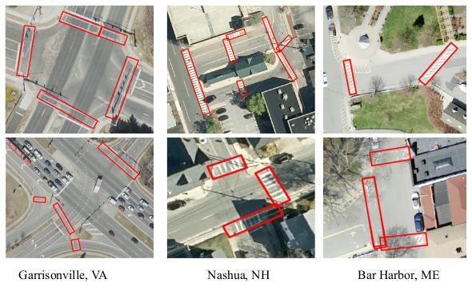

# CrosswalkNet
### An optimized deep learning framework for pedestrian crosswalk detection in aerial images
Crosswalk detection from satellite and aerial imagery is a key area of focus within remote sensing technology, particularly for its applications in urban planning and traffic management. Crosswalks are critical for pedestrian safety, delineating areas where pedestrians are expected to cross roads. Accurate identification of these zones from above can significantly aid in the planning and monitoring of infrastructure tailored for pedestrian safety, which is especially pertinent in densely populated urban areas.

